# Tutorial de criação de função Lambda com persistência em um banco de dados PostgreSQL

## Preparação inicial

### Passo 1:
Crie uma nova VPC em uma região de sua preferência. Indo no campo de busca, escrevendo `VPC` e clicando em cima do primeiro link

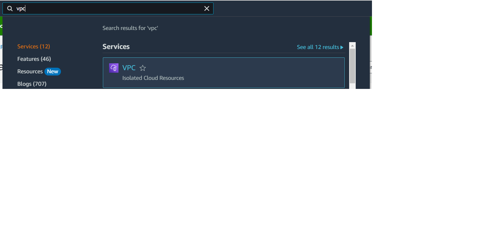

### Passo 2:
Crie um banco de dados PostgreSQL para a persistência do projeto.

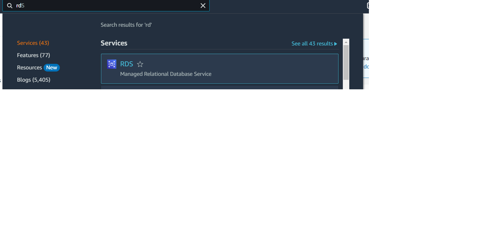

### Passo 3:
Enquanto estiver criando o banco de dados, vincule o mesmo à sua nova VPC aberta para qualquer IPV4

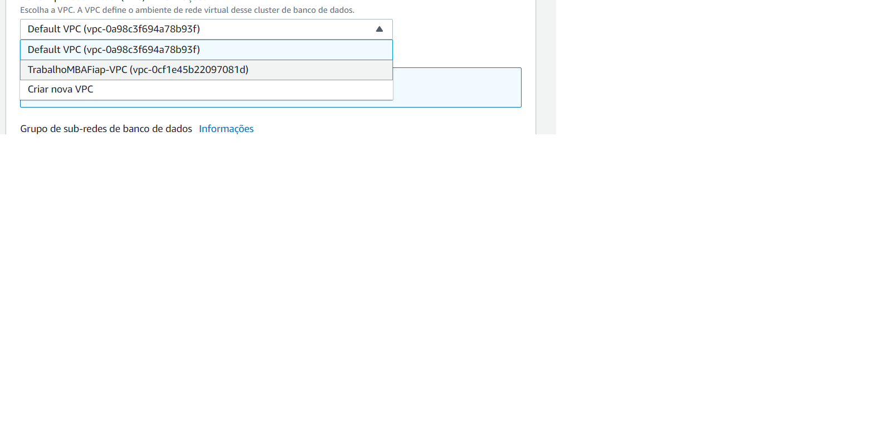

### Passo 4:
No arquivo `FinalTrabalhoServerless/index.js`: Contém as descrições da função de conexão ao banco de dados, as credenciais devem ser alteradas de acordo com o seu
novo banco de dados PostgreSQL criado na aws

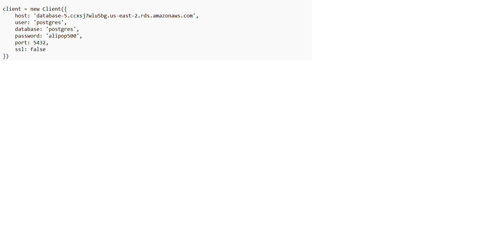

### Passo 5:
Apagar o arquivo `FinalTrabalhoServerless/index.zip` e selecionar os arquivos `FinalTrabalhoServerless/index.js`, `FinalTrabalhoServerless/package.json`, `FinalTrabalhoServerless/node_modules`, `FinalTrabalhoServerless/package-lock.json`, clicar com o botao direito em cima de algum deles e clicar em compactar para arquivo zip

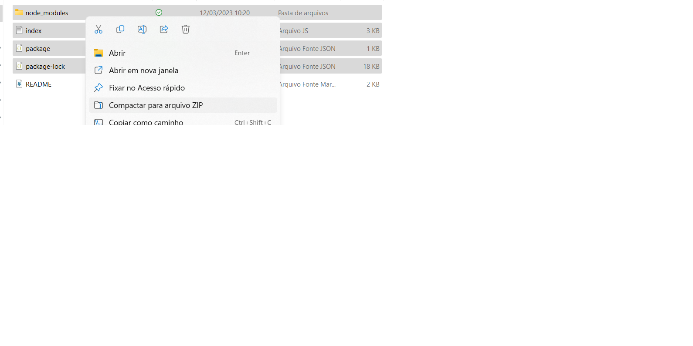

## Criando a função Lambda

### Passo 1:
No seu painel principal do AWS Lambda, clique no botão `Create Function` (`Criar Função`).

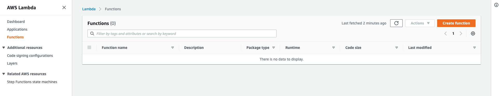

### Passo 2:
Na tela de criação de função selecione a opção `Author from Scratch` (`Criar do zero`).
Insira um nome para sua função.
Selecione a versão da engine do Node JS que deve ser usada
Na área `Execution Role` (`Papel de execução`) deixe a opção padrão para que o lambda crie uma role padrão
com permissão de envio de dados para o CloudWatch.

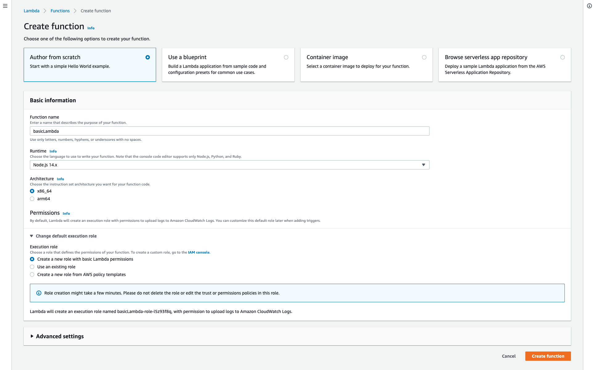

### Passo 4:
Na tela da função lambda cole o conteúdo do arquivo `function/index.js`, salve e clique no botão `Deploy`
para disponibilizar a função lambda para execução.

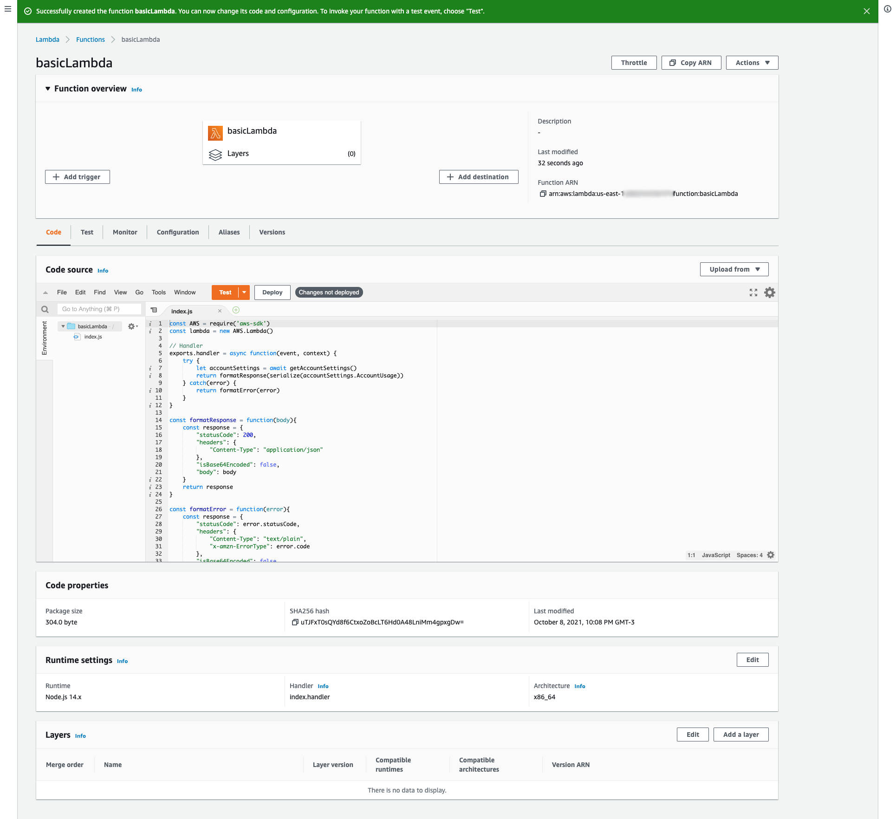

### Passo 5:
Na aba `Configuration` (Configuração) selecione o item `Permissions` (`Permissões`) no menu lateral esquerdo,
e em seguida clique na role exibida na caixa `Execution Role` (`Papel de Execução`) para ir para a tela do 
IAM.

### Passo 6:
Na tela de detalhes da role no IAM, você tem duas opções, criar uma nova `policy` (`política`) ou adicionar
uma política em linha, vamos pela segunda opção, então ao lado direito clique no link `Add inline policy`
(`Adicionar política em linha`).

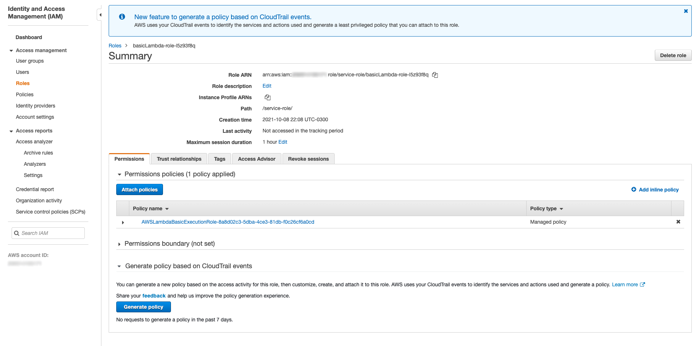

### Passo 7:
Clique em `Choose a service` (`Escolha um serviço`) e digite `lambda` no campo de busca. 

### Passo 8:
Selecione a opção `Lambda` nos resultados abaixo.

### Passo 9:
No item `Access level` (`Nível de acesso`) selecione o item `Read` (`Leitura`) para expandir as opções e marque 
a opção `GetAccountSettings`. Clique em `Review Policy` (`Revisar política`).

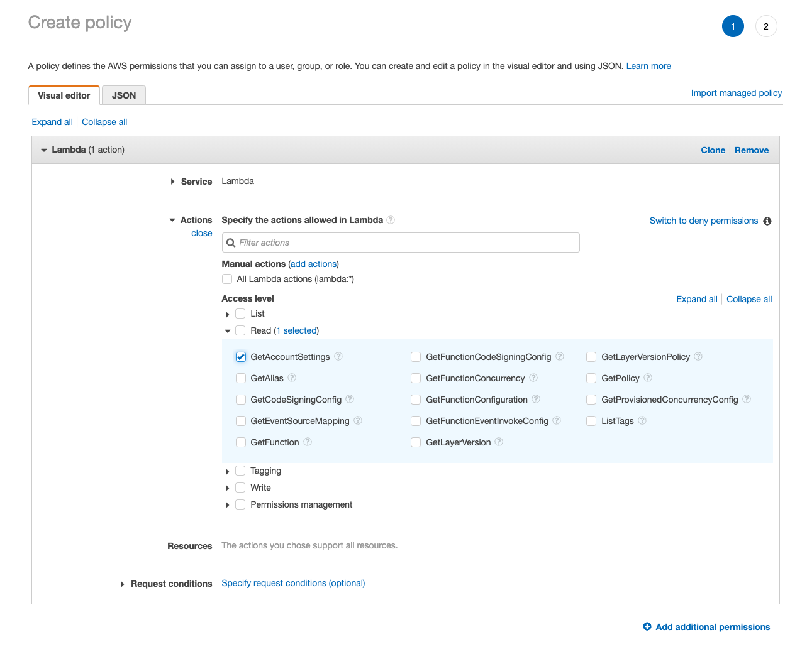

### Passo 10:
Dê um nome para sua nova política de segurança, e clique em `Create Policy` (`Criar Política`). 

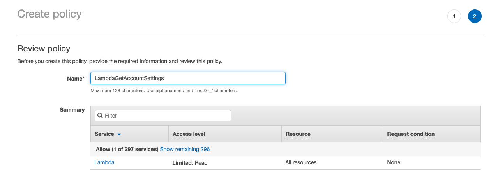

### Passo 11:
Agora você deve poder ver a sua nova política listada na role da sua função lambda. 

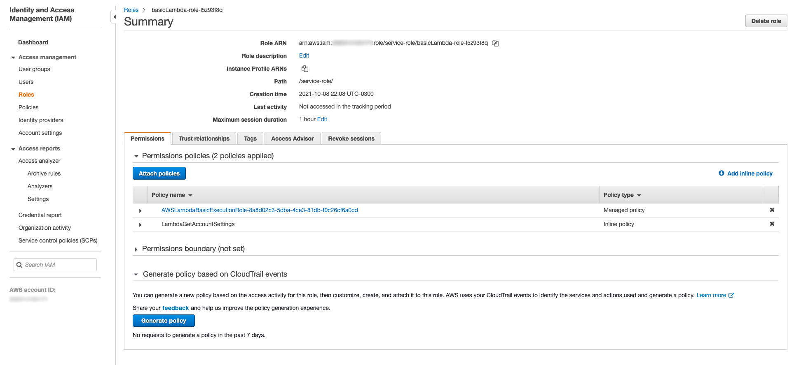

### Passo 12:
Este é o resultado da sua função.

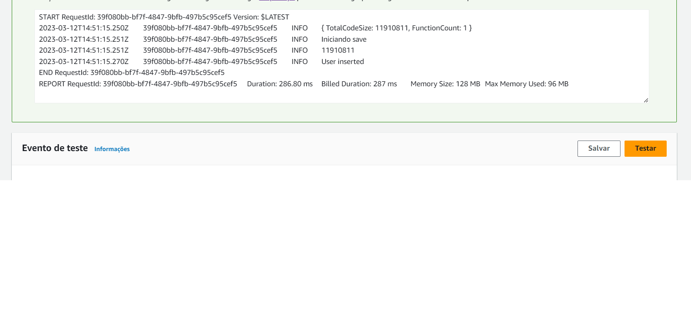
